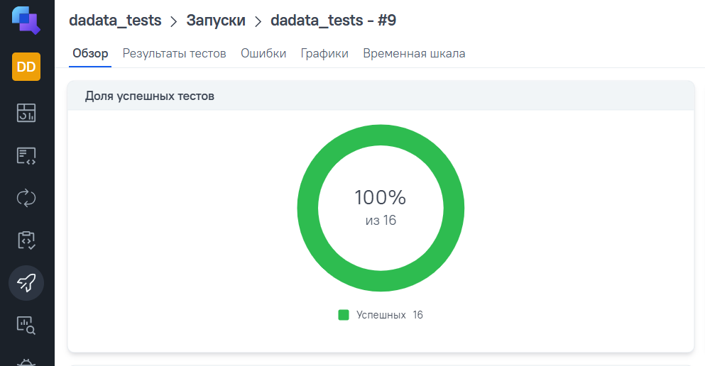
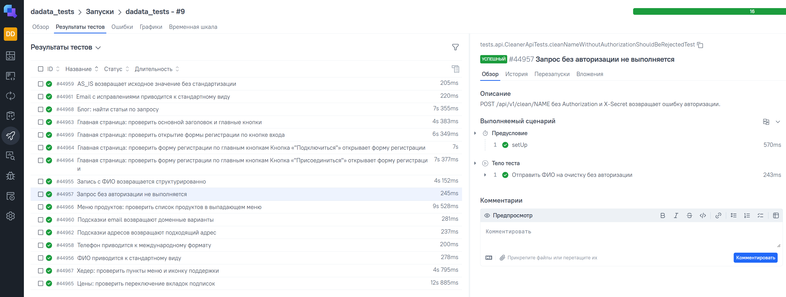

# Проект по автоматизации тестирования сервиса [DaData](https://dadata.ru/)

<p align="center">

</p>

# 📝 Содержание:

- [Стек](#стек)
- [Реализованные проверки](#реализованные-проверки)
- [Структура проекта](#структура-проекта)
- [Запуск тестов из терминала](#запуск-тестов-из-терминала)
- [Сборка в Jenkins](#сборка-в-jenkins)
- [Allure Report](#allure-report)
- [Allure TestOps](#allure-testops)
- [Уведомление в Telegram](#уведомление-в-telegram)

<a id="стек"></a>

## ☕ Стек:

[](https://www.java.com/)
[](https://gradle.org/)
[](https://rest-assured.io/)
[](https://selenide.org/)
[](https://www.jetbrains.com/idea/)
[](https://junit.org/junit5/)
[](https://www.jenkins.io/)
[](https://aerokube.com/selenoid/)
[](https://allurereport.org/)
[](https://qameta.io/)

В проекте автотесты написаны на **Java**. Сборка — **Gradle**, тесты — **JUnit 5**.

Для UI используется **Selenide**, для API — **Rest Assured**. Отчёты формируются в **Allure Report** и передаются в **Allure TestOps**. Проверки в тестах — через **AssertJ**, тестовые данные генерируются **DataFaker**.

<a id="реализованные-проверки"></a>

## 📠 Реализованные проверки:

### UI

- главная страница: заголовок и кнопки «Подключиться», «Присоединиться»
- меню в шапке и иконка у пункта «Поддержка»
- переключение вкладок подписок в разделе «Цены»
- поиск статей в разделе «Блог»
- форма входа по кнопке «Войти»
- формы регистрации по кнопкам «Подключиться» и «Присоединиться»
- список продуктов в меню «Продукты»

### API

- Cleaner: нормализация ФИО, телефона и email, AS_IS, запись с ФИО, запрос без авторизации
- Suggestions: подсказки по адресу и email

Ручные сценарии — в [manual-test-cases.md](src/test/manual-test-cases.md).

<a id="структура-проекта"></a>

## 📁 Структура проекта

```text
src/test/java
├── allure       # вложения и listener для Allure
├── api          # клиенты к API DaData
├── config       # настройки (ключи, url)
├── models       # модели запросов и ответов
├── pages        # page object'ы для UI
├── specs        # общие настройки REST Assured
└── tests
    ├── api      # API-тесты
    └── ui       # UI-тесты

src/test/resources
├── schemas      # json-схемы ответов API
├── tpl          # шаблоны request/response в Allure
└── application.properties
```

<a id="запуск-тестов-из-терминала"></a>

## 💻 Запуск тестов из терминала

Команды для Windows, запускать из корня проекта.

Все тесты:

```
gradlew.bat test
```

Только UI:

```
gradlew.bat test --tests "tests.ui.*"
```

Только API:

```
gradlew.bat test --tests "tests.api.*"
```

Для API-тестов нужны ключи DaData. Они лежат в файле `dadata-secret.properties` в домашней папке:

```
dadata.api.token=...
dadata.api.secret=...
```

Если ключей нет — api-тесты не запускаются.

<a id="сборка-в-jenkins"></a>

## [🔧 Сборка в Jenkins](https://jenkins.autotests.cloud/job/dadata_tests/)

После настройки Jenkins тесты можно запускать удалённо с параметрами браузера, версии браузера, размера окна и адреса Selenoid.

<a id="allure-report"></a>

## [📊 Пример Allure-отчёта](https://jenkins.autotests.cloud/job/dadata_tests/4/allure/)

Собрать отчёт:

```
gradlew.bat allureReport
```

Открыть в браузере:

```
gradlew.bat allureServe
```

### Основная страница отчёта

<p align="center">

</p>

### Тест-кейсы

<p align="center">

</p>

### Графики

<p align="center">

</p>

### Пример API-теста в отчёте

<p align="center">

</p>

### Пример UI-теста в отчёте

<p align="center">

</p>

<a id="allure-testops"></a>

## [ Allure TestOps](https://allure.autotests.cloud/project/5248/launches)

Результаты автотестов передаются из Jenkins в Allure TestOps.

<p align="center">

</p>

### Результаты тестов в Allure TestOps

<p align="center">

</p>

<a id="уведомление-в-telegram"></a>

##  Уведомление в Telegram

После прогона тестов в Jenkins в Telegram приходит сообщение с результатом сборки.

<p align="center">

</p>
