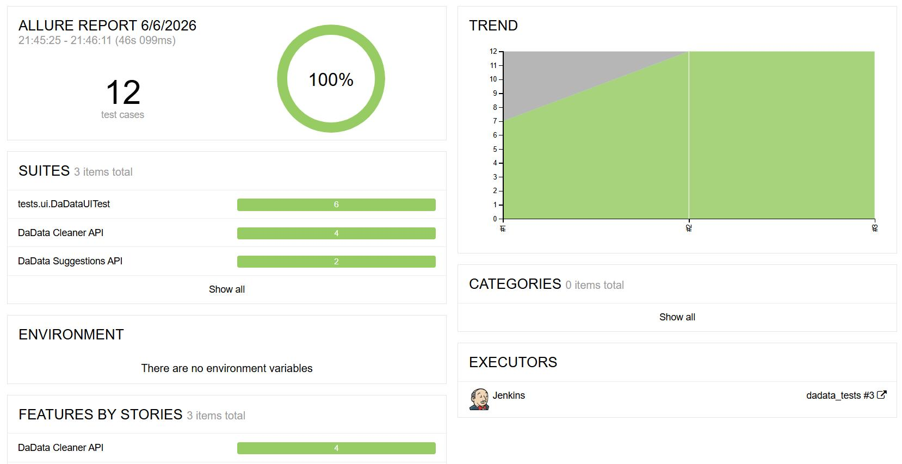
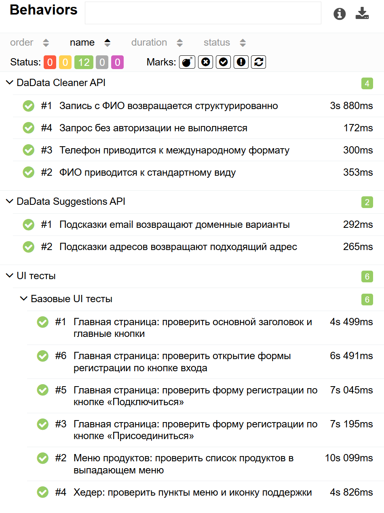
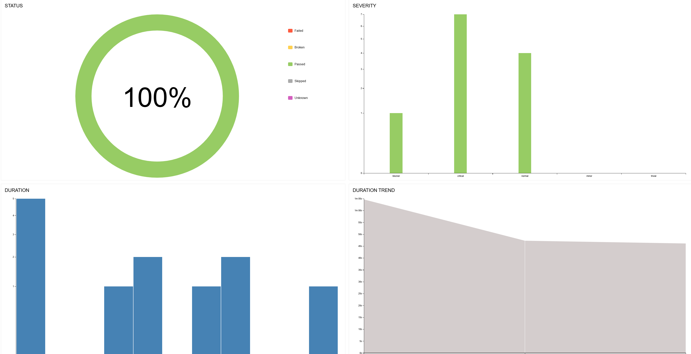
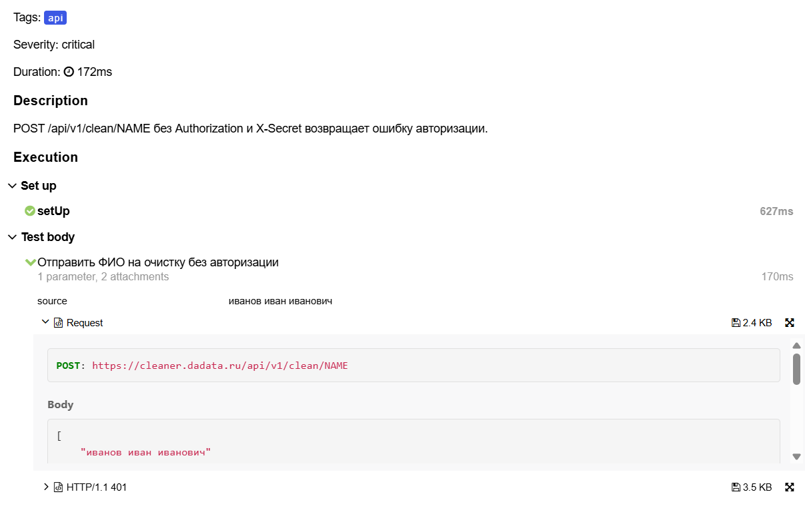
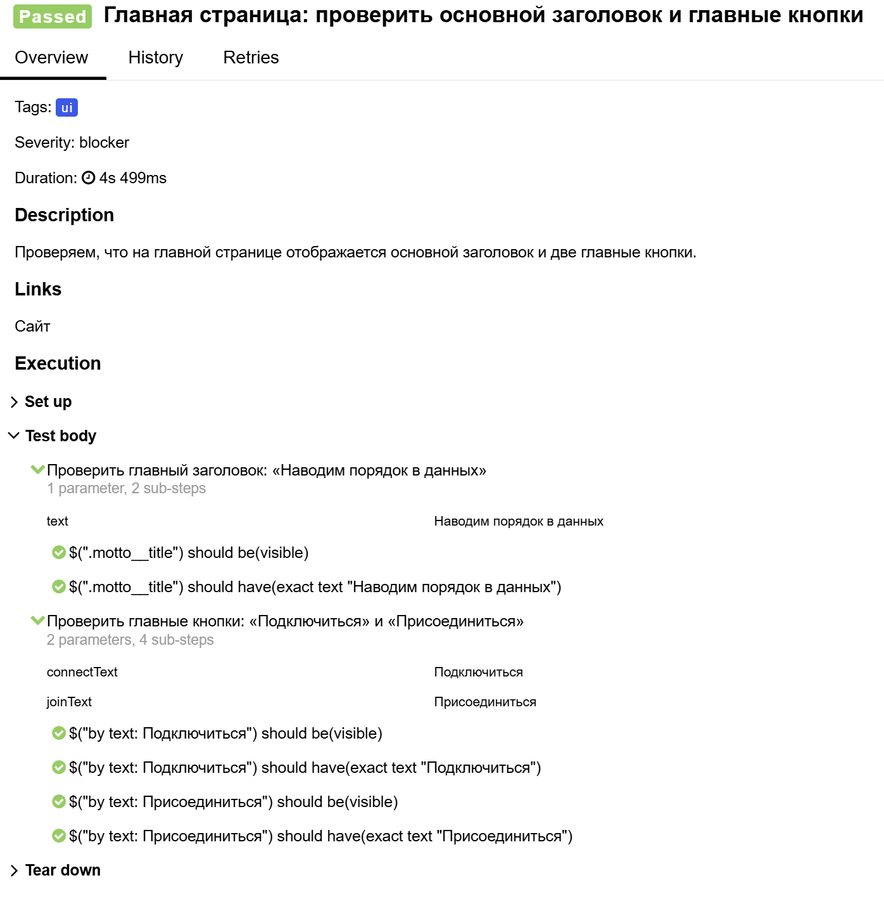
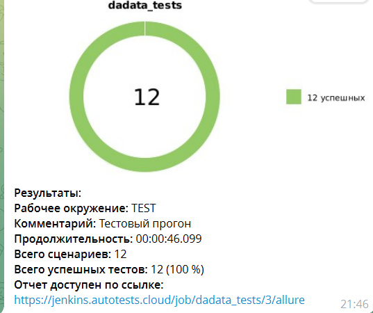

# Проект по автоматизации тестирования сервиса [DaData](https://dadata.ru/)

<!-- здесь будет баннер проекта -->
<!-- <p align="center">

</p> -->

# 📝 Содержание:

- [Стек](#стек)
- [Реализованные проверки](#реализованные-проверки)
- [Структура проекта](#структура-проекта)
- [Запуск тестов из терминала](#запуск-тестов-из-терминала)
- [Allure Report](#allure-report)
- [Уведомление в Telegram](#уведомление-в-telegram)

<a id="стек"></a>

## ☕ Стек:


В проекте автотесты написаны на **Java**. Сборка — **Gradle**, тесты — **JUnit 5**.

Для UI используется **Selenide**, для API — **Rest Assured**. Отчёты формируются в **Allure Report**. Проверки в тестах — через **AssertJ**, тестовые данные генерируются **DataFaker**.

<a id="реализованные-проверки"></a>

## 📠 Реализованные проверки:

### UI-тесты

### Главная страница и кнопки на ней

### Меню в шапке сайта

### Форма входа и регистрации

### Меню «Продукты»

### API-тесты (Cleaner)

### Очистка ФИО

### Очистка телефона

### Запись с ФИО

### Запрос без авторизации

### API-тесты (Suggestions)

### Подсказки по адресу

### Подсказки по email

### Ручные тест-кейсы

Описание ручных проверок — в файле [manual-test-cases.md](src/test/manual-test-cases.md).

<a id="структура-проекта"></a>

## 📁 Структура проекта

```text
src/test/java
├── allure       # вложения и listener для Allure
├── api          # клиенты к API DaData
├── config       # настройки (ключи, url)
├── models       # модели запросов и ответов
├── pages        # page object'ы для UI
├── specs        # общие настройки REST Assured
└── tests
    ├── api      # API-тесты
    └── ui       # UI-тесты

src/test/resources
├── schemas      # json-схемы ответов API
├── tpl          # шаблоны request/response в Allure
└── application.properties
```

<a id="запуск-тестов-из-терминала"></a>

## 💻 Запуск тестов из терминала

Команды для Windows, запускать из корня проекта.

Все тесты:

```
gradlew.bat test
```

Только UI:

```
gradlew.bat test --tests "tests.ui.*"
```

Только API:

```
gradlew.bat test --tests "tests.api.*"
```

<!-- здесь будет скрин успешного запуска тестов из терминала -->
<!-- <p align="center">

</p> -->

Для API-тестов нужны ключи DaData. Они лежат в файле `dadata-secret.properties` в домашней папке:

```
dadata.api.token=...
dadata.api.secret=...
```

Если ключей нет — api-тесты не запускаются.

<a id="allure-report"></a>

## 📊 Allure Report

Собрать отчёт:

```
gradlew.bat allureReport
```

Открыть в браузере:

```
gradlew.bat allureServe
```

### Основная страница отчёта

<p align="center">

</p>

### Тест-кейсы

<p align="center">

</p>

### Графики

<p align="center">

</p>

### Пример API-теста в отчёте

<p align="center">

</p>

### Пример UI-теста в отчёте

<p align="center">

</p>

<a id="уведомление-в-telegram"></a>

##  Уведомление в Telegram

После прогона тестов в Jenkins в Telegram приходит сообщение с результатом сборки.

<p align="center">

</p>
